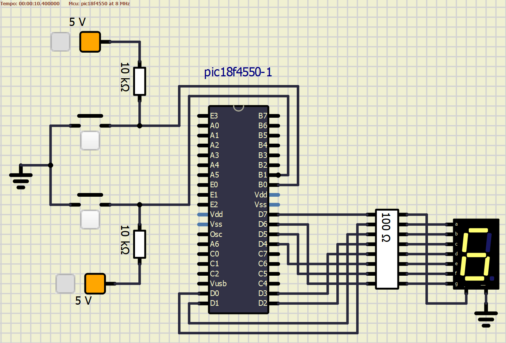
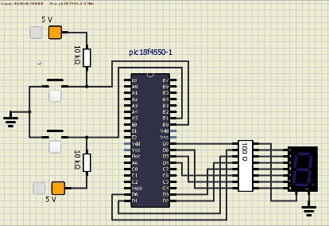

# Cronômetro Digital com Timer e Interrupções

## Integrantes
- André Jacob Suaide - **13864673**
- Henrique de Oliveira Araujo - **13863950**
- Oliver Kenzo Kobayashi - **13676930**
- Vítor Augusto Paiva de Brito - **13732303**

Este repositório contém o projeto para a disciplina de **Aplicação de Microprocessadores (SEL0614)**, no qual será desenvolvido um cronômetro digital utilizando o microcontrolador *PIC18F4550* programado em linguagem **C**.

## Visão Geral do Projeto
Este projeto busca desenvolver um cronômetro digital usando o microcontrolador *PIC18F4550*, programado em **C**. A ideia é fazer com que um display de 7 segmentos conte de 0 a 9 em *loop*, alterando o período de contagem (1 segundo ou 0,25 segundos) ao pressionar botões específicos. Para isso, serão utilizados temporizadores e interrupções para gerenciar a contagem de tempo e a interação com os botões. O projeto será implementado no compilador **MikroC PRO** for *PIC* e testado no **SimulIDE**, comparando essa abordagem em **C** com uma implementação anterior feita em Assembly para explorar as vantagens e desafios de cada método.

## Conceitos Envolvidos
A prática explora diversos conceitos de sistemas embarcados, como temporização, interrupções e interface de I/O. O **Timer0** é configurado para gerar interrupções periódicas que regulam o intervalo de contagem no display de 7 segmentos. Quando um botão na porta **RB0** é pressionado, a contagem ocorre a cada 1 segundo; quando o botão da porta **RB1** é ativado, a contagem muda para intervalos de 0,25 segundos. O uso de interrupções permite que o microcontrolador responda rapidamente a eventos externos, garantindo que a troca de períodos de contagem seja feita de forma eficiente e precisa.

A configuração do **Timer0** inclui a definição do prescaler e a ativação das interrupções globais e específicas do periférico. O acionamento do display de 7 segmentos, ligado à porta **D**, é controlado por meio da varredura dos pinos, assegurando que cada número de 0 a 9 seja exibido corretamente.


## Comentários Explicativos do Código

### Configuração inicial do microcontrolador (`ConfigurarMCU`)
```C
void ConfigurarMCU() {
  ADCON1 |= 0x0F;         // Define todos os pinos como digitais
  INTCON2.RBPU = 0;       // Desativa o resistor pull-up global
  TRISD = 0;              // Define PORTD como saída
  PORTD = 0;              // Inicializa PORTD com valor 0
  TRISB.RB0 = 1;          // Configura RB0 como entrada
  TRISB.RB1 = 1;          // Configura RB1 como entrada
  PORTB.RB0 = 1;          // Define estado inicial alto para RB0
  PORTB.RB1 = 1;          // Define estado inicial alto para RB1
}
```

- `ADCON1 |= 0x0F;`: Configura todos os pinos do microcontrolador como digitais.
- `INTCON2.RBPU = 0;`: Desativa o resistor pull-up global.
- `TRISD = 0;`: Define o `PORTD` como saída.
- `PORTD = 0;`: Inicializa `PORTD` com valor 0.
- `TRISB.RB0 = 1;`: Configura o pino `RB0` como entrada.
- `TRISB.RB1 = 1;`: Configura o pino `RB1` como entrada.
- `PORTB.RB0 = 1;`: Define o estado inicial alto para o pino `RB0`.
- `PORTB.RB1 = 1;`: Define o estado inicial alto para o pino `RB1`.

### Exibição do display de 7 segmentos (`exibirNumero`)
```C
void exibirNumero(int numero) {
  if (numero < 0 || numero > 9) {
    LATD = 0x00;   
    return;
  }
  switch (numero) {
    case 0: LATD = 0b00111111; break;
    case 1: LATD = 0b00000110; break;
    case 2: LATD = 0b01011011; break;
    case 3: LATD = 0b01001111; break;
    case 4: LATD = 0b01100110; break;
    case 5: LATD = 0b01101101; break;
    case 6: LATD = 0b01111101; break;
    case 7: LATD = 0b00000111; break;
    case 8: LATD = 0b01111111; break;
    case 9: LATD = 0b01101111; break;
  }
}
```

- A função recebe um número de 0 a 9 e define os segmentos correspondentes no `PORTD` para exibi-lo no display.
- Se o número estiver fora do intervalo (menor que 0 ou maior que 9), a função desliga os segmentos (`LATD = 0x00;`).

### Casos do `switch`:
- Cada caso define o valor de `LATD` para acender os segmentos corretos e exibir o número desejado no display.

### Configuração das interrupções (`ConfiguraInterrupcoes`)
```C
void ConfiguraInterrupcoes() {
  RCON.IPEN = 1;            // Ativa prioridade de interrupção
  INTCON.GIEH = 1;          // Habilita interrupções de alta prioridade
  INTCON.GIEL = 1;          // Habilita interrupções de baixa prioridade
  INTCON.TMR0IF = 0;        // Limpa flag do Timer0
  INTCON.TMR0IE = 1;        // Ativa interrupção do Timer0
  INTCON2.TMR0IP = 1;       // Define prioridade alta para Timer0
  INTCON.INT0IF = 0;        // Limpa flag de interrupção INT0
  INTCON.INT1IF = 0;        // Limpa flag de interrupção INT1
  INTCON.INT0IE = 1;        // Ativa interrupção de RB0 (INT0)
  INTCON3.INT1IE = 1;       // Ativa interrupção de RB1 (INT1)
  INTCON3.INT1IP = 1;       // Define prioridade alta para INT1
  INTCON2.INTEDG0 = 1;      // Configura borda de subida para INT0
  INTCON2.INTEDG1 = 1;      // Configura borda de subida para INT1
}
```

- `RCON.IPEN = 1;`: Ativa o sistema de prioridades de interrupção.
- `INTCON.GIEH = 1;`: Habilita interrupções de alta prioridade.
- `INTCON.GIEL = 1;`: Habilita interrupções de baixa prioridade.
- `INTCON.TMR0IF = 0;`: Limpa a flag de interrupção do `Timer0`.
- `INTCON.TMR0IE = 1;`: Habilita interrupção do `Timer0`.
- `INTCON2.TMR0IP = 1;`: Define alta prioridade para `Timer0`.
- `INTCON.INT0IF = 0;`, `INTCON.INT1IF = 0;`: Limpam as flags de interrupção `INT0` e `INT1`.
- `INTCON.INT0IE = 1;`, `INTCON3.INT1IE = 1;`: Habilitam as interrupções externas em `RB0` (INT0) e `RB1` (INT1).
- `INTCON3.INT1IP = 1;`: Define alta prioridade para `INT1`.
- `INTCON2.INTEDG0 = 1;`, `INTCON2.INTEDG1 = 1;`: Configuram interrupções para a borda de subida.

### Rotina de interrupção de alta prioridade (`INTERRUPT_HIGH`)
```C
void INTERRUPT_HIGH() iv 0x0008 ics ICS_AUTO {
  if (INTCON.TMR0IF) {                  // Timer0
    contador = (contador + 1) % 10;     // Incrementa e reinicia ao alcançar 10
    exibirNumero(contador);             // Atualiza o display com o valor do contador
    // Reinicializa o Timer0
    T0CON.TMR0ON = 0;
    TMR0H = TimerHigh;
    TMR0L = TimerLow;
    T0CON.TMR0ON = 1;
    INTCON.TMR0IF = 0;      // Limpa a flag de interrupção do Timer0
  }

  if (INTCON.INT0IF) {      // Botão RB0 (INT0)
    TimerHigh = 0x0B;       // Ajusta Timer0 para 1 segundo
    TimerLow = 0xDC;
    T0CON.TMR0ON = 0;
    TMR0H = TimerHigh;
    TMR0L = TimerLow;
    T0CON.TMR0ON = 1;
    INTCON.INT0IF = 0;      // Limpa a flag de interrupção INT0
  }

  if (INTCON3.INT1IF) {     // Botão RB1 (INT1)
    TimerHigh = 0xC2;       // Ajusta Timer0 para 0.25 segundo
    TimerLow = 0xF7;
    T0CON.TMR0ON = 0;
    TMR0H = TimerHigh;
    TMR0L = TimerLow;
    T0CON.TMR0ON = 1;
    INTCON3.INT1IF = 0;     // Limpa a flag de interrupção INT1
  }
}
```

- Variáveis globais `TimerHigh`, `TimerLow` e `contador` são usadas para controle do tempo e contagem.
- `if (INTCON.TMR0IF)`: Verifica se a interrupção do `Timer0` ocorreu.
  - Incrementa `contador` e reinicia ao alcançar 10 (`contador = (contador + 1) % 10;`).
  - Atualiza o display com o novo valor.
  - Reinicializa o `Timer0` com `TimerHigh` e `TimerLow` e limpa a flag de interrupção.

#### Verificação de botões (`INT0IF` e `INT1IF`)
- `if (INTCON.INT0IF)`: Quando o botão `RB0` é pressionado, ajusta o `Timer0` para contar 1 segundo.
- `if (INTCON3.INT1IF)`: Quando o botão `RB1` é pressionado, ajusta o `Timer0` para contar 0.25 segundo.

### `main()`
```C
void main() {
  ConfigurarMCU();          // Inicializa o microcontrolador
  T0CON = 0b00000100;       // Configura Timer0 (prescaler 1:32)
  ConfiguraInterrupcoes();  // Habilita interrupções gerais

  while (1) {
    // Loop principal do programa;
  }
}
```

## O circuito

O circuito foi montado no **SimulIDE** de acordo com a figura abaixo, com as resistências para haver um controle da corrente e prevenir possível 'queimas' de componentes em um cenário de montagem do circuito físico.



### Funcionamento do circuito

O vídeo abaixo demonstra o funcionamento do circuito no software **SimulIDE**, apresentando os diferentes modos de operação de acordo com o pressionamento dos botões, alterando o período do cronômetro com 1 segundo ou 0,25 segundos.



## Comparação com o Projeto em Assembly para o 8051
No projeto anterior, que usava Assembly para o microcontrolador *8051*, a programação envolvia maior detalhamento no controle de registradores e sub-rotinas. O código em Assembly exigia que o desenvolvedor gerenciasse manualmente cada aspecto das operações de delay, verificações de botão e manipulação de bits para o acionamento do display. Embora esse nível de controle permitisse uma compreensão aprofundada do funcionamento do hardware, ele tornava o desenvolvimento mais trabalhoso e sujeito a erros.

Por outro lado, a implementação atual em **C** para o *PIC18F4550* oferece uma abordagem mais intuitiva e eficiente. A linguagem **C** permite que o desenvolvedor trabalhe com funções e bibliotecas que simplificam a configuração de periféricos e o gerenciamento de interrupções, tornando o código mais legível e fácil de manter. Essa modularidade facilita a separação de blocos de código, como a configuração do timer e a lógica de exibição no display.

## Vantagens e Desvantagens
A principal vantagem da implementação em C para o *PIC18F* está na produtividade e clareza do código. A linguagem de médio nível permite que a programação seja mais rápida e menos suscetível a erros, especialmente com o suporte de *IDE*s e depuradores que ajudam na análise do funcionamento do programa. A desvantagem, no entanto, reside na dependência do compilador, que pode gerar código ligeiramente menos eficiente em termos de uso de memória quando comparado a um código Assembly cuidadosamente otimizado.

No projeto em Assembly com o *8051*, a vantagem estava na eficiência de memória e na possibilidade de otimizações finas, algo relevante em sistemas com recursos limitados. Contudo, a complexidade da programação em **Assembly** aumentava significativamente o tempo de desenvolvimento e dificultava a manutenção.
